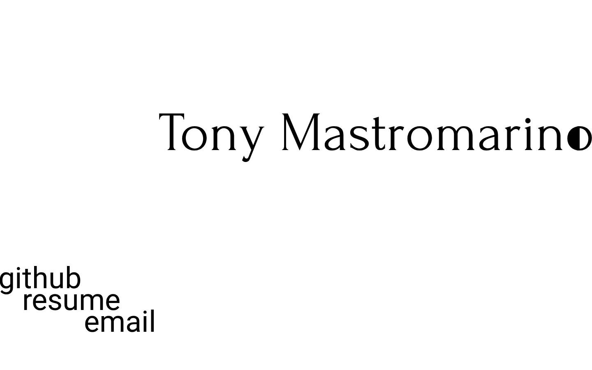
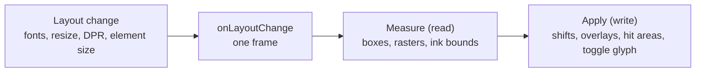

# Personal Site

Tony Mastromarino’s portfolio landing page: a name, three links and sweeping bars that invert the type, built with Svelte and Vite. Live at **[tonydoesathing.github.io](https://tonydoesathing.github.io)**.



The owner’s requirements, and how each is met, are in [DESIGN.md](DESIGN.md). They are binding: change the code, not the look.

## Setup

Install Node 22.13 or later (see `.nvmrc`), then run `npm install`. The dev container does this for you and adds Playwright’s browsers; inside it, start the dev server with `npm run dev -- --host 0.0.0.0` so the forwarded port reaches it.

| Script | Purpose |
| --- | --- |
| `npm run dev` | Vite dev server with hot reload. |
| `npm run build` | Production build to `dist/`. |
| `npm run preview` | Serve the built `dist/` locally. |
| `npm run check` | Type-check JS and Svelte with `svelte-check`. |
| `npm run lint` | ESLint, then Prettier in check mode. |
| `npm run format` | Rewrite files with Prettier. |
| `npm test` | Unit tests, then end-to-end tests. |

## Testing

`npm test` runs both suites; `npm run test:unit` and `npm run test:e2e` run one each.

- **Unit** (`tests/unit`, Vitest): the pure helpers.
- **End to end** (`tests/e2e`, Playwright): Chromium, Firefox and WebKit, against a Vite server it starts on port 5174. It covers edge contact at DPR 1, 1.5 and 2, toggle seams, wrapping, hit areas, navigation, link motion, reduced motion, theme persistence, keyboard use, console warnings, bar progress across resizes, and the plain-text fallback when canvas reads fail or forced colours are on. Outside the dev container, run `npx playwright install` first.
- **Visual** (`@visual` tests): Chromium screenshots, with the bars hidden, compared against the baselines in `tests/e2e/visual.spec.js-snapshots`. The baselines are Linux Chromium renders, so run them in the dev container. After an intended visual change, review the diff, then run `npx playwright test visual --update-snapshots`.

These still need a person:

- Real touch devices: tap, press and hold, and dragging off a link.
- Moving the window between displays with different pixel densities.
- Real macOS and Windows font rendering, including Safari.

## Deployment

Every push to `master` runs `.github/workflows/deploy.yml`, which builds the site and deploys `dist/` to GitHub Pages. It runs no checks or tests, so run `npm run check`, `npm run lint` and `npm test` before pushing. In the repository’s Pages settings, set **Source** to **GitHub Actions**.

## How it works

**Measure the real font raster.** Edge alignment and snug hit boxes need the glyphs’ visible ink, which layout boxes don’t give: they include side bearings and line boxes, and differ between engines. So `rasterizeText` draws each text node onto a canvas with its computed font, at its on-screen position and device resolution, and `inkBounds` finds the ink by alpha. The heading and the first link then shift by whole device pixels to meet the screen edges, and the links (and **Tony**, once wrapped) show a cropped image of that same raster in place of their text, so what is measured is exactly what is shown. The HTML text stays in place, transparent, for layout, selection and assistive technology.

**Three coordinate spaces.**

| Space | Used for |
| --- | --- |
| CSS px | Layout, `getBoundingClientRect`, and every style written. |
| Device px | Physical pixels, CSS px × `devicePixelRatio`. Written positions are snapped to them (`lib/pixels.js`) so edges stay flush and overlays crisp at fractional ratios. |
| Raster px | Pixels of a `Raster`. The same size as device px, with the origin at the raster’s `offsetX`/`offsetY`. `viewportBox` converts raster bounds to viewport CSS px. |

**Inversion.** Everything in the foreground is white with `mix-blend-mode: difference`. White over white is black and over black is white, so one colour reads as the primary colour in both themes and flips wherever a bar passes beneath. Raster overlays and the toggle glyph are white on transparent for the same reason.

**Fallback.** When a canvas can’t be read back faithfully (no 2D context, or ink in the blank margin because anti-fingerprinting noised the read), `rasterizeText` returns null and each part stays plain HTML text: unaligned, with the link’s own box as its hit target and the toggle button over the letter’s box. In forced-colours mode the overlays are hidden and the plain text shows.

**Update cycle.** `onLayoutChange` coalesces everything that can move text on the pixel grid into one frame, and each pass reads every measurement before writing any:



## Project layout

```
index.html                 pre-paint theme script, font preloads, <noscript> fallback
public/                    résumé PDF, favicon, self-hosted fonts with licences
src/
  main.js                  mounts App
  App.svelte               page composition
  app.css                  fonts, palette, layers, inversion, forced colours
  content.js               name, links and link offsets
  components/
    Heading.svelte         the name, aligned to the right edge, hosting the toggle
    ThemeToggle.svelte     the toggle button and its sliced glyph
    themeGlyph.js          draws the toggle glyph from the last letter's raster
    LinkMenu.svelte        the link list, fitted to its rendered words
    MenuLink.svelte        one link: overlay, underline box, hit area
    SweepBar.svelte        one background bar
    Baseline.svelte        a zero-size marker on a text baseline
  lib/
    rasterizeText.js       draws a text node at device resolution
    inkBounds.js           finds ink in a raster
    alphaMask.js           copies raster ink to a white canvas
    edgeText.js            cropped ink overlays pinned to viewport edges
    alignHeading.js        keeps the heading flush with the right edge
    fitWords.js            link overlays, underline geometry and hit areas
    onLayoutChange.js      one-frame scheduler for layout changes
    pixels.js              device-pixel snapping
    linkMotion.js          link animation state machine and durations
    theme.svelte.js        theme state, persistence and system sync
tests/
  unit/                    Vitest
  e2e/                     Playwright, with visual baselines
```
